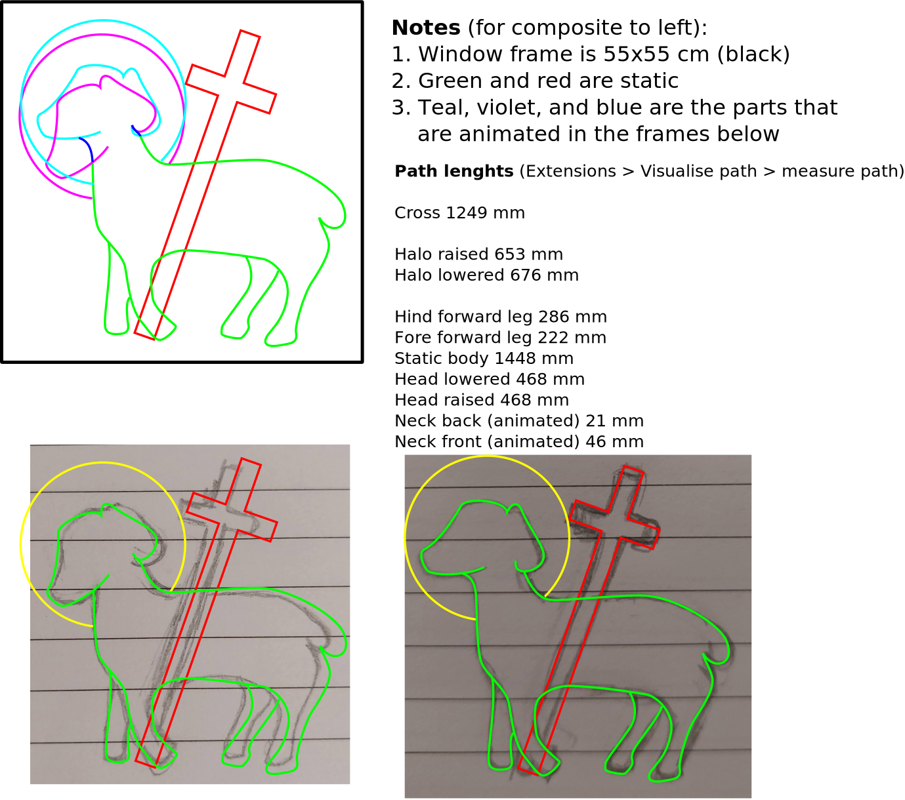

# EL Wire Animated Christmas Light

These are animated Christmas lights made with electroluminescent wire, using the deprecated El Escudo Dos hat for the Arduino.

Who needs a 555 timer when one can overcomplicate it with an Arduino and EOL daughter board!

My motivation for this project was my irritation that the only "Christmas" lights I can buy are for an Americanised market, i.e. the generic "holidays". I wanted my own Christmas lights, that actually had some Christian symbolism. So my wife drew a design, which I traced in Inkscape. I printed out the design and transfered it to the plastic board with carbon paper, I then painstakingly super glued it to the board, and only glued my tongue together once.

## Demo

Above, one can see the lights in action. It is a simple two frame animation, where the Lamb bows and raises His head.

## Pattern

## Debug

The [test-lights](./test-lights.ino) sketch will cycle through each light channel.